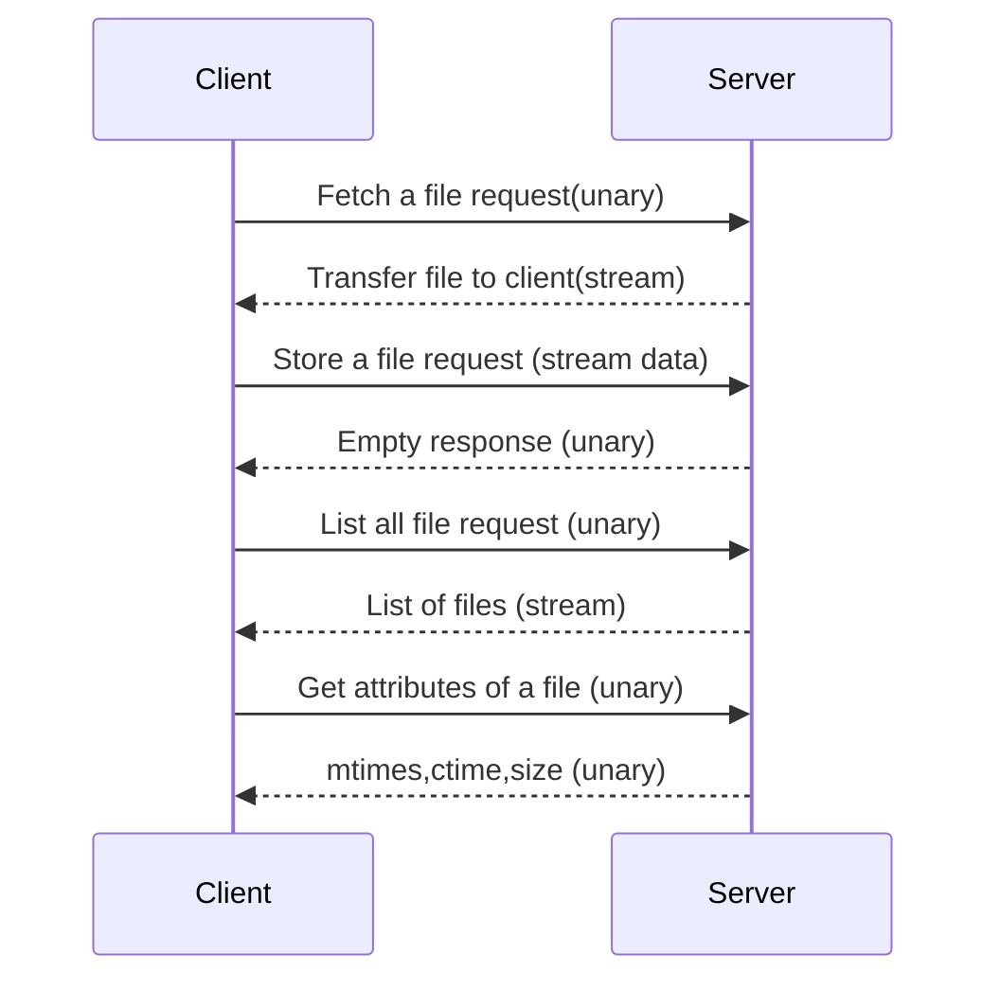
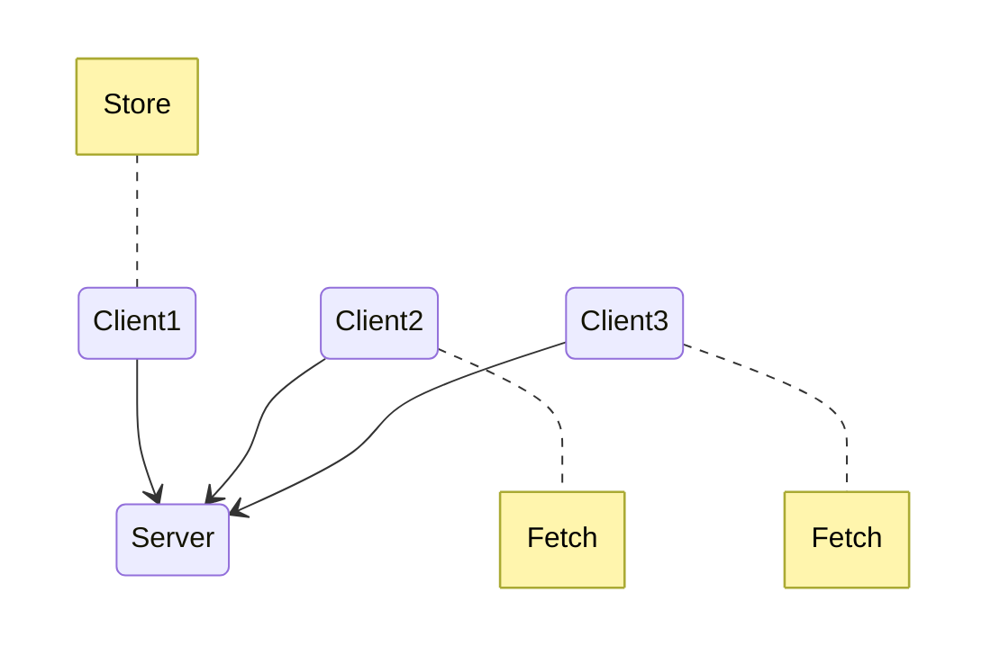
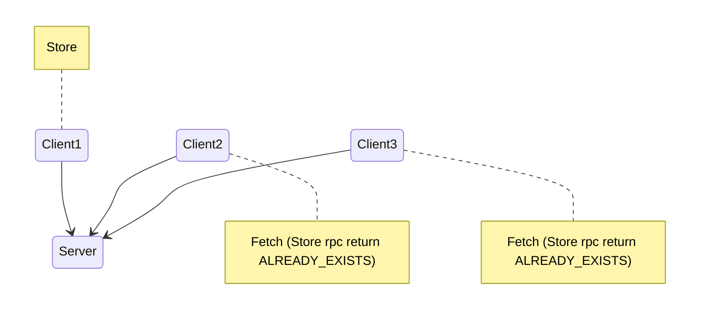
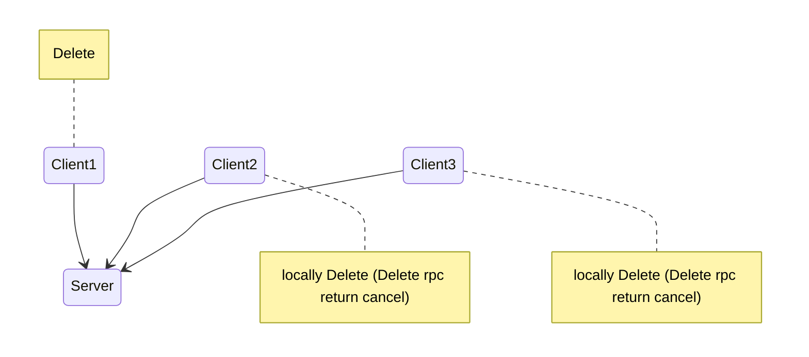
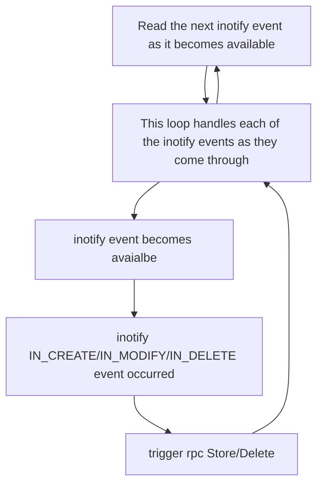
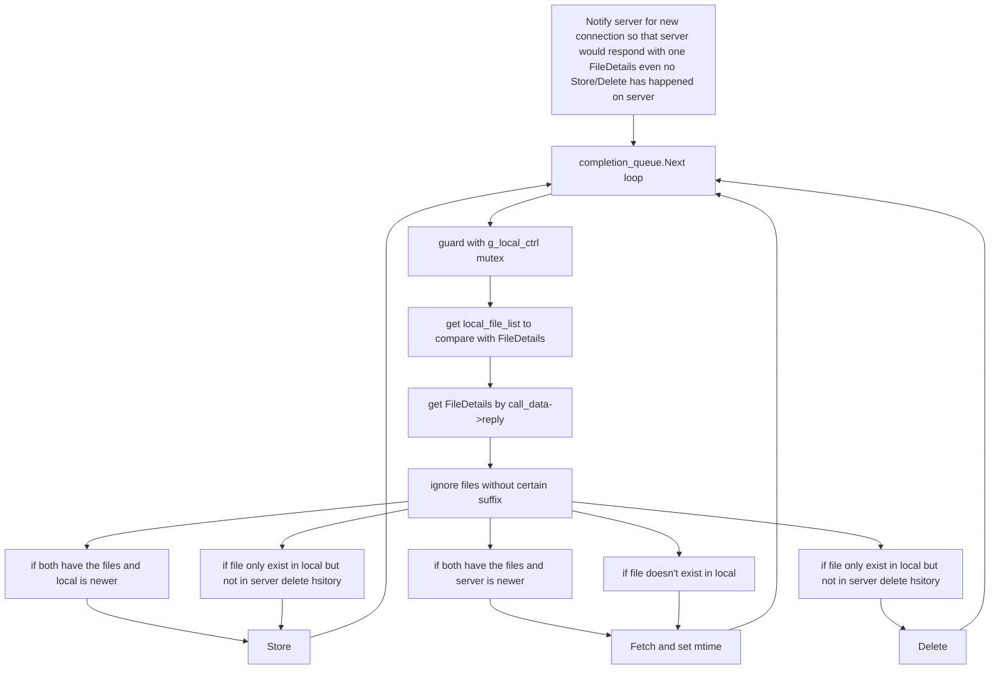
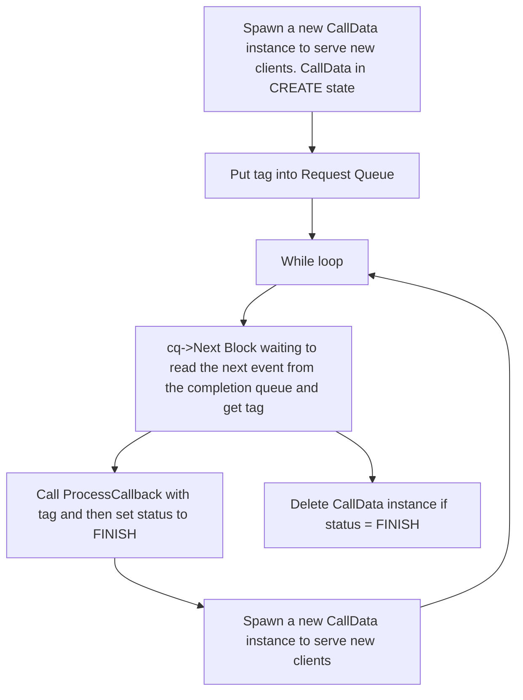

# Project 4 gios-spr-23-pr4

This is **HO NGOK CHAO**'s Readme file.


## Project Description

This project has two parts. 

**Part 1** is a basic gRPC **file sharing service** with 4 **synchronous Remote Procedure Calls (rpc)** **fetch**, **store**, **list**, and **Stat**.



**part 2** utilize above 4 fundamental methods plus **RequestWriteLock** (synchronous) which would be used by **Store** and **Delete** (synchronous) so that only one client can change the state of the server at a time, and a asynchronous rpc **CallBackList** which client would use to asynchronously request/receive about the attributes (including **modification time**) of files in the server so that multiple clients' files can stay **sync** with those of server via calling fetch/store/delete respectively according existence/mtime. This constitutes a **Distributed File System (DFS)** and is achieved by using **multiple threads** on both clients and server.



## Project Design

### part 1

Almost all are hard requirements in English translated to **Protocol Buffer** (Interface Definition Language) then protocol buffer compiler generates the client/server interfaces in C++ for **service DFSService**.

Trade-offs explained:

```protobuf
    // unary to stream
    rpc Fetch(FileRequest) returns (stream FetchResponse); 
    message FileRequest {
        string name = 1;
    }
    message FetchResponse {
            bytes chunk_data = 2;
    }
```

- **Fetch**: This rpc is for client to fetch a file from the server, naturally the input is the **filename** that it wants which server would resolve to a full server side path, the response is a **stream** of bytes of the file since the file can be of arbitrary size (the alternative is a Unary response with repeated field inside a single message, but it is unnecessary and make implementation harder).
- On the server side, we read to main memory and send 1000 bytes (reasonably small to make sure we have enough memory) each to client.
- On the client side, it just open a file initially and keep appending to it until the stream is closed.

```protobuf
    // stream  to unary
    rpc Store(stream StoreRequest) returns (google.protobuf.Empty) {}; 
    message StoreRequest {
        string name = 1;
        bytes chunk_data = 2;
    }
```

- **Store**: This rpc is for client to store a file to the server, again naturally the input of the rpc is the **file name** and a **stream of bytes of the file** (with similar reason as **fetch**).
- On the client side,it read from a file and keep putting **sequence of messages** into the stream, so every message has both **name** and **chunk_data**.
- On the server side, it read one message from the stream every time, and every time open a file with **name** and append the **chunk_data** received (for first message of the stream, I would clear all the content inside it first). This design is a bit awkward but since server side doesn't know when the stream would end, it has to open and close a file multiple times. One **alternative is to include file size into the message**, so that server can create a file on the first message and only close it after receiving enough data (or timeout), but that increase the implementation complexity hence I didn't do it this time.

```protobuf
    // unary to unary
    rpc Delete(FileRequest) returns (google.protobuf.Empty);
```

- **Delete**: This rpc is for client to delete a file in the server. Not much design on server side delete if found and return **grpc::StatusCode::OK** else **grpc::StatusCode::NotFound**

```protobuf
    // unary to stream
    rpc List(google.protobuf.Empty) returns (FileList);
    message FileList {
        map<string,fixed64> mtime =1;
    }
```

- **List**: This rpc is for client to retrieve a map from server for all its files whose key is the filename of a file in server and value is the mtime of the file.
- On the client side, we call the rpc and simply convert **grpc::protobuff:map** into std::map of C++, the alternative is to use other type like a vector of pair as a response from server and convert that to std::map but that would be a detour.
- On the server side, retrieve the file list using system call opendir() and stat to retrieve the list and attributes including mtimes; the alternative is to use Filesystem library since **C++17** but this project restrict the C++ version to be **C++14** and the **<experimental/filesystem>** in C++14 is possibly not stable enough hence I stick with the C style. Othewise, I could have used **std::experimental::filesystem::last_write_time**

```protobuf
    // unary to unary
    rpc Stat(FileRequest) returns (Attributes); 
    message Attributes {
        uint64 size = 1;
        int64 mtime = 2;
        int64 ctime = 3;
    }
```


- **Stat**: This rpc is for client to retrieve Stat of a file in server. The only decision made is to use int64 as the type in protobuf; the alternative is to use **google::protobuf::timestamp** but I feel like calling **timestamp.set_seconds** to set the value and **timestamp.seconds()** to compare two timestamp too troublesome for this project since I am going to always compare in seconds.

### part 2

First, let's talk about design for **DFSService** in this part. It is an extension to part1 plus two rpc **RequestWriteLock** and **CallBackList** which are necessary for this Distributes File System where multiple clients and one server exists.

Trade-offs explained:

For part1's rpc:

- **Store**: On the client side, to prevent multiple clients try to store the same file to the server at the same time. It would have to call **RequestWriteLock** first and only seeing grpc::StatusCode::OK it would continue to make the Store rpc to the server. Need to sync mtimes on both server and the client calling since that would impact all clients' decisions calling fetch. It also need to submit **CRC checksum** (a hash representation of the file) to the server, so that the server side can decide if the a store is necessary based on both **mtime** and **CRC**.
  The **alternative** is to do the CRC checking on the client side before calling store, which is possible we just need to make one more RPC call to retrieve both CRC and mtime from server (store if the file doesn't exist on the server of the client's file mtime is newer), which I choose not to do to reduce complexity.
- **Delete**: Same as Store, need to RequestWriteLock;
- **Fetch**: Doesn't require a WriteLock since it doesn't change state of the server, but client need to sync the mtime with server when writing the file down, otherwise it would trigger a **store** (since the file become "newer" than server). Note that the comparison using CRC is done on client side, because mtime comparison is already on client side (via **HandleCallbackList**) so keeping all comparison to make the decision on the same side makes it easier to debug. The **alternative** is make the CRC comparison on server side just like **Store**.

For the additional rpc:

- **RequestWriteLock**: On the server side There is **one** global `std::map<std::string,std::string> FileOwner` where first element is filename, and second element is meant for clientid so that only if second element equals to "released" the client may obtain the lock for the file.
  The map is  guarded by **one** global `std::lock_guard<std::mutex> guard(g_owners_mutex)` so that only one client is changing the state of the map at a time since it is possible multiple clients are calling Store at the same time and is being served by different **worker threads** of gRPC, while there is only one **server thread** (Details explained in testing).
  **Alternaive** design is to have multiple variables of type **pair** to represents locks to different file, so that not all file locks is blocked from changing while we are only changing one of the entry, but then we would have multiple mutex as well. Here I choose to save resource and easy implementation over performance (which I am unsure also, since creating/managing multiple mutexes also consumes time).
- **ReleaseWriteLock**: Similar to RequestWriteLock but the opposite which is used for changing the second element of `std::map<std::string,std::string> FileOwner` to **"released"**

- **CallBackList**: On the server side, there are two methods concerning this asynchronous rpc on dfs-lib-servernode-p2 i.e. ProcessCallback ProcessQueuedRequests
- **ProcessCallback**: In ProcessCallback I did something similar to **List** in part1 i.e. list all the file and get attributes via opendir() and stat(). **Alternatively**, the client need to send the file list with mtime to server, than server can compute the change and send back to client. But since the original implementation in **dfslibx-clientnode-p2.h** only send a empty string to init the rpc, I cannot use this alternative design, but just do the comparision on client side in **HandleCallbackList**
- **ProcessQueuedRequests**: This method decide when server **async threads** would call **RequestCallbackList** so that one request from client in Completion Queue would be ready to be service and proceed to next stage by calling **ProcessCallback**; I called RequestCallbackList when there is **file change or new connection** (requiring mutex protecting file changes flag and rpc notifying the server there is new connection) so that only latest detailed file list is send to client **otherwise it is easy to have a stale CallBackList sent to HandleCallbackList** which would trigger a Fetch (due to file not found in local) and then a Store (due to file creation in Fetch)and then a Delete again. Detailed explained in implementation.

- **HandleCallbackList**: On Client side, once the client side **completion queue** (grpc::CompletionQueue DFSClientNode::completion_queue) provides **call_data->reply**

```c++
dfs_service::FileDetails meta_list = call_data->reply;
```

The client would get a list of file name and its mtimes.

- if both server and client have the file and local file is newer, we call store
- if both side have the file but server is newer, we call fetch and set the mtime (so that it won't trigger another store).
- if file doesn't exist on local, we call fetch and set mtimes. (problematic, if we have delete timestamp, then it's better to compare delete timestamp from OS with server mtime)
- if file only exist on local, we call delete if the file is in server delete history, but since It is also possible that the INOTIFY event triggered **store failed** or the async thread is slower than the watcher thread, we call store.





Secondly, let's talk about **threading design**.

Client side, we have **watcher thread** running **InotifyWatcher** which would monitor for creation/modification and delete event and trigger **Store** and **Delete** respectively. We also have **async thread** which would continuously calling the async rpc **CallBackList** and wait for response from server. We don't want watcher thread to compete with CallBackList since it is meaningless to handle a callbacklist that's stale if **watcher thread** hasn't complete yet. I used **mutex g_local_ctrl** here to make this explicit so that if a delete event happened, CallBackList would only be handled after the completion of the Delete rpc call.

Server side, we have **Async threads** running **HandleAsyncRPC** to serve the asynchronous rpc **CallBackList** and worker threads sprawn by gRPC to serve implicitly to serve synchronous rpc; note that there is one **Server Thread** running **HandleSyncRPC** but that's really holding the server up. **Queue thread** will be running **queued_requests_callback** which is set to **ProcessQueuedRequests** to make request available for **HandleAsyncRPC** to serve. Again, we don't want **worker threads** to compete with **Queue thread** since just like client it is meaning less to broadcast a stale callbacklist; here not only a mutex is used but also a boolean flag so that the sequence is always **Store/Delete** finished first and then we process queued requests. We cannot do it on the client side, because for client the change might not be originally from local.  

## Flow of Control Graphs

### part 1

**part 1** is a synchrnous gRPC service with client and server. The sequence chart from the repository already fully explained the flow, it is perhaps more important to spend time on **part2** from threading perspective. **Part1** sequence chart attached at reference.

Basically, Server start up first and client connect to it; then we can perform various synchronous gRPC call waiting for **unary** or **stream** response from server; each response is a **message** with structure as described in **.proto** file. 

On Client side, it would exit after performing the **rpc** since there is no **watcher thread** as in part2 to hold the client up by always running **DFSClient::InotifyWatcher** in a loop, also there is no **async thread** like part 2 which also can hold the client from exiting because of **completion_queue.Next(&tag, &ok)** is blocking and upon completion of **HandleCallbackList** we would trigger another rpc  from client by calling **InitCallbackList**.

On server side, the main thread would be blocked on this->server->Wait(); Hence the server would be running until is destroyed or **HandleSignal** called exit(0).

### part 2

**Part 2**, is a hybrid gRPC (we have synchronous and asynchronous rpc) supported DFS. It already has a sequence graph from the project repository. I attached it at Reference as well.

On client side, it has **watcher thread** and **async thread**.

**watcher thread** running **InotifyWatcher** which use registered callback method called **InotifyWatcherCallback** which it would continuously run in a while loop. As described in project design we don't want it to compete with **async thread** to avoid handling of stale callbacklist hence a mutex **g_local_ctrl** is used in **InotifyWatcherCallback** 

```c++
    std::lock_guard<std::mutex> lock(g_local_ctrl);
    callback();
```

The implementation of callback() is a while loop processing inotify events running InotifyEventCallback() on each of them. The event possible are described in **inotify.h** and we only care about three type of events **IN_CREATE**, **IN_MODIFY** and **IN_DELETE**.

In **dfs-client-p2.cpp::InotifyWatcher**




**watcher thread** is running **HandleCallbackList**. The first callbacklist rpc is triggered by the **main thread** and then subsequently after each completion of **HandleCallbackList** it would trigger another **InitCallbackList()** to continue to submit asynchronous rpc CallBackList request in to **completion queue** for server to handle.

```c++
// Initialize the callback list
this->client_node.InitCallbackList()
```

The response from server is a message listing File Attributes of a file including name, size, mtime and ctime.

```protobuf
message FileDetail {
    string name = 1;
    uint64 size = 2;
    int64 mtime = 3;
    int64 ctime = 4;
}
message FileDetails{
    repeated FileDetail filedetail = 1;
}
```





On Server Side, we have **Async thread**, **Server thread** and **Queue thread**. 

**Async thread** is running **HandleAsyncRPC** in which it retrieve available request from server side **completion queue** by cq->Next(&tag, &ok) and then call **Proceed** to use **ProcessCallback** (which is just preparing the attributes of files on server and inject to CallData instance given).




**Server thread** is just there to hold the server, can be seen in Testing.

**Queue thread** is running **queued_requests_callback** which in turn is actually running logic in **ProcessQueuedRequests** in which this thread call **RequestCallbackList** to make server side request (using tag of a CallData instance created in **Async thread** and stored in **queue_request** with status **CREATE**) to unblock **cq->Next** above to proceed to **ProcessCallback**.


## Implementation

Most of the code is already discussed in **Project Design** and **Flow of Control Graphs**. 

Part1 is a pure synchronous gRPC service. Part 2 is a hybrid gRPC service with asynchronous and synchronous rpc with multithreading. 

In part1, as shown by Class diagram in the original GaTech repository.


**DFSClient** is a composition of **./bin/dfs-client-p1**, the instance of DFSClient live and die with **./bin/dfs-client-p1**. **DFSClientNode** class is a part of **DFSClient**, they have separate lifetimes. **DFSClient** construct and destroy **DFSClientNode**.

Similarly **DFSServerNode** is a composition of **./bin/dfs-server-p1**.


In part2 Client Side is the same in terms of Class Design. But now the Server side has DFSServiceRunner in which it sprawn the **threads** and is a composition of **DFSServerNode**. And **DFSData** is a part of **DFSServiceRunner**, this class handles async **CallBackList** together with **DFSCallDataManager** (a part of **DFSData**)


```c++
std::mutex g_owners_mutex;
std::mutex g_modified_file;
```

**g_owners_mutex** is used to protect **multiple worker threads** try to access the owner map representing **WriteLock**, g_modified_file is used to prevent both **queue thread** and **worker threads** try to change the state change happened in server but not yet serving requests from client for CallBackList.

### Racing condition not adjusted in my implementation 

On client side, even using mutex there is no guarantee of order when a local delete event happen, which of **watcher thread** (sending Delete rpc) **async thread (getting FileDetails list from server)** run first so if Server side give a stale version of list (triggerd by something else not the Delete rpc that hasn't happened yet) we could triggered a fetch. Note that from **project design**, you can see that I directly call fetch without checking mtime of the file on server if the file doesn't exist on local, this is because I haven't find a way to record the accurate delete time of a file so that we can compare with mtime of the file on server and decide either do nothing or call fetch. 

On serverside, again even using mutex there is no guarantee of order when a Delete rpc is made from client, which of **async thread** (injecting the file details on server into CallData) or **grpc background worker Thread** (serving the Delete rpc call) get run first, so just like above it would broadcast a stale FileDetail list; however upon compeletion of serving Delete rpc call, I designed to send another FileDetails list to client. Now since as shown in project design, when the file on exist on local and in server delete history, I would remove the file locally hence after sometimes, server and client would stay sync eventually.


## Testing

For part 1, I simply manually tested with using the command List,Stat,Store,Delete,Fetch directly using the binary of client. The other way is to use grpcurl.

For part 2, I manually tested with mounting two clients with the server and use terminal to add/remove file to generates the INOTIFY events. 

The other way to do stress is listed in this post **Helder Stress Test for project 4**


For synchronous gRPC server there are multiple worker threads serving requests. For example, I log out the **thread ID** serving the store request.

```bash
>> DEBUG1: Thread 140000620431104 is serving store
>> DEBUG1: Thread 140000561682176 is serving store
```


So even though there is only one so called **server thread**, we still need to take care of shared resources protections those synchronous rpc.

```c++
// Start the synchronous server on a separate thread
std::thread thread_server(HandleSyncRPC<RequestT, ResponseT>, this->server);
dfs_log(LL_SYSINFO) << "Server thread " << " started";
threads.push_back(std::move(thread_server));
```

Hence, I think the server thread running **HandleSyncRPC** only exists to hold the server from exiting, given from documentation **void grpc::Server::Wait** is blocking.

```c++
/**
 * Static callback for handling synchronous requests to the service protocol.
 *
 * @tparam RequestT
 * @tparam ResponseT
 * @param server
 */
template <typename RequestT, typename ResponseT>
static void HandleSyncRPC(std::shared_ptr<grpc::Server> server) {
    server->Wait();
}
```


## References:

opendir https://man7.org/linux/man-pages/man3/opendir.3.html

Filesystem library (since C++17) https://en.cppreference.com/w/cpp/filesystem

void grpc::Server::Wait https://grpc.github.io/grpc/cpp/classgrpc_1_1_server.html#a009682cfb2c453839b9eab318bbb8222


P4L1 Remote Procedure Calls
https://gatech.instructure.com/courses/270294/pages/p4l1-remote-procedure-calls?module_item_id=2666700


gRPC C++ Reference
https://grpc.github.io/grpc/cpp/index.html
Protocol Buffers 3 Language Guide
https://developers.google.com/protocol-buffers/docs/proto3
gRPC C++ Examples
https://github.com/grpc/grpc/tree/master/examples/cpp
gRPC C++ Tutorial
https://grpc.io/docs/tutorials/basic/cpp/
Protobuffers Scalar types
https://developers.google.com/protocol-buffers/docs/proto3#scalar
gRPC Status Codes
https://github.com/grpc/grpc/blob/master/doc/statuscodes.md
gRPC Deadline
https://grpc.io/blog/deadlines/
Helder Stress Test for project 4
https://piazza.com/class/lco3fd6h1yo48k/post/1212

Part 1 sequence chart 

Part 2 sequence chart 
